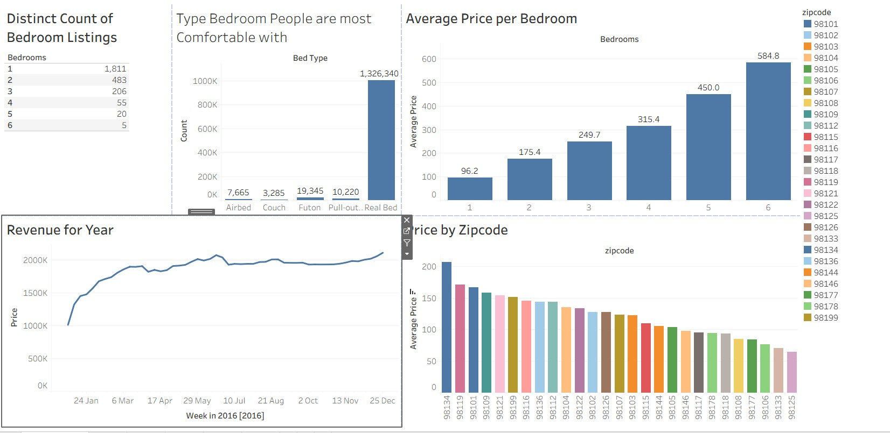

# Airbnb Data Analysis & Tableau Dashboard

This project is a Tableau dashboard built to analyze Airbnb listings data, focusing on pricing, availability, and bedroom type.

The dashboard was created as a hands-on learning project inspired by Alexander Freberg’s public Tableau Airbnb project.

## 📊 Dashboard Features
- Average price by ZIP code (bar chart)
- Price distribution across neighborhoods
- Bedroom Type prefered by the People
- Room type analysis
- Interactive filters for ZIP code and property type
- Geographic visualization using generated latitude and longitude in Tableau

## 🛠 Tools & Technologies
- Tableau Public
- CSV dataset (Airbnb listings)
- Data cleaning & geographic role configuration
- Map-based visualization (ZIP-level)

## 🧠 Key Learnings
- Handling geographic roles in Tableau
- Resolving NULL latitude/longitude issues
- Using State and ZIP code context for geocoding
- Designing interactive dashboards
- Dashboard layout and UX best practices

## 📷 Dashboard Preview

## 📌 Inspiration & Credit
This project is inspired by the following Tableau Public dashboard:
- Alexander Freberg – Airbnb Full Project  
  https://public.tableau.com/app/profile/alexander.freberg/viz/AirBnBFullProject/Dashboard1

This repository is for learning and portfolio purposes only.

## 👤 Author
Imran Akbar — AML & IT Project Management Professional
10+ years in Compliance, Sanctions, and Financial Crime Systems
Passionate about leveraging data and automation to strengthen AML frameworks.
🌐 LinkedIn
www.linkedin.com/in/mr-imran-akbar
